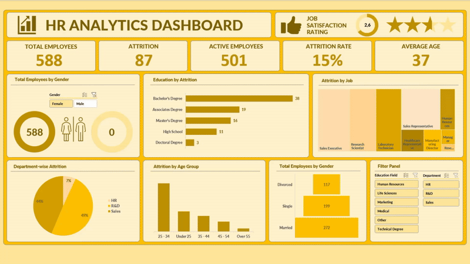

# 📊 HR Analytics Dashboard (Excel Project)

## 📌 Deskripsi
Proyek ini adalah dashboard analitik HR berbasis **Microsoft Excel** yang memberikan gambaran menyeluruh tentang data karyawan, tingkat attrition, distribusi usia, pendidikan, gender, dan kepuasan kerja. Visualisasi ini membantu tim HR dalam mengambil keputusan berbasis data untuk meningkatkan retensi dan kepuasan karyawan.

## 📷 Preview Dashboard

## 🛠 Fitur Utama
- Ringkasan total karyawan, karyawan aktif, dan tingkat attrition.
- Distribusi gender karyawan.
- Analisis attrition berdasarkan tingkat pendidikan.
- Analisis attrition berdasarkan jabatan dan departemen.
- Distribusi attrition berdasarkan kelompok usia.
- Distribusi status pernikahan karyawan.
- Rating kepuasan kerja.

## 📋 Dataset
Dataset berisi informasi seperti:
- Gender  
- Usia  
- Departemen  
- Tingkat pendidikan  
- Status pernikahan  
- Posisi/jabatan  
- Status attrition  
- Rating kepuasan kerja  

## 🚀 Tools yang Digunakan
- **Microsoft Excel** – Pembuatan dashboard dan visualisasi data.
- **Pivot Table & Pivot Chart** – Analisis data.
- **Conditional Formatting** – Penyorotan tren dan pola data.
- **Data Validation & Filter** – Interaktivitas pada dashboard.

## 📈 Insight dari Dashboard
- Kelompok usia **25–34 tahun** memiliki tingkat attrition tertinggi.
- Pemegang **Bachelor's Degree** paling banyak keluar.
- Departemen **Sales** menyumbang lebih dari **50% attrition**.
- Kepuasan kerja rata-rata masih rendah (**2.6/4**).
